# Brymon Team Builder

A full-stack Pokémon team builder built from scratch using a custom **PHP MVC architecture**, **PostgreSQL**, **Vanilla JavaScript**, and the **PokéAPI**.

> ✅ **Status:** Version 1.0 live at [brymonteambuilder.com](https://brymonteambuilder.com) — Version 2 in active development

---

# Live Demo

https://brymonteambuilder.com

---

# Overview

Brymon is a full-stack Pokémon team-building application designed to let users create, configure, analyze, save, edit, manage, and share complete Pokémon teams — and discover teams built by other trainers.

The project was built as a portfolio application to demonstrate practical full-stack engineering using a custom backend architecture rather than relying on a full-stack framework.

Brymon combines:

- Custom PHP MVC architecture
- PostgreSQL relational data modeling
- Authentication and authorization
- Interactive JavaScript state management
- PokéAPI integration (REST and GraphQL)
- Pokémon Showdown import/export
- A browsable Pokédex reference
- Public team sharing, likes, and following
- Trainer profiles and a personalized dashboard feed
- Backend validation
- CSRF protection
- Automated testing
- Production deployment

---

# Screenshots

## Home

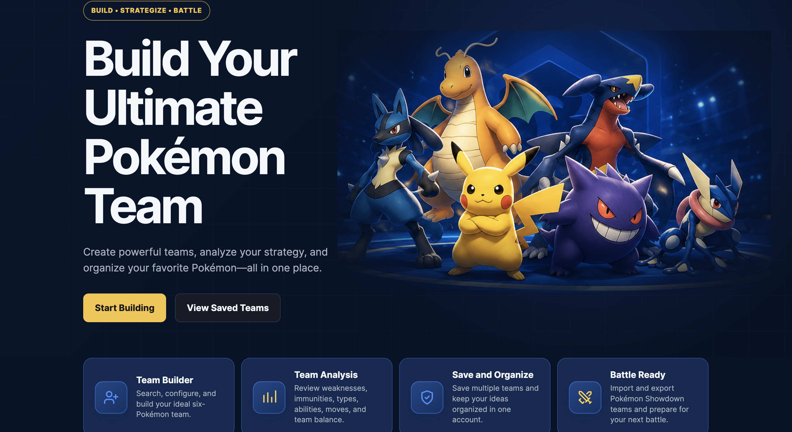

---

## Team Builder

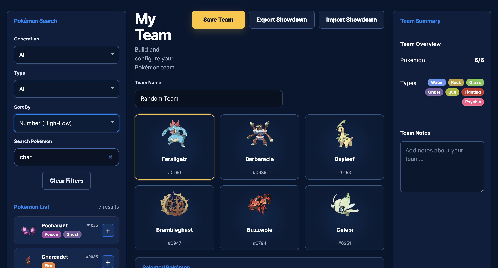

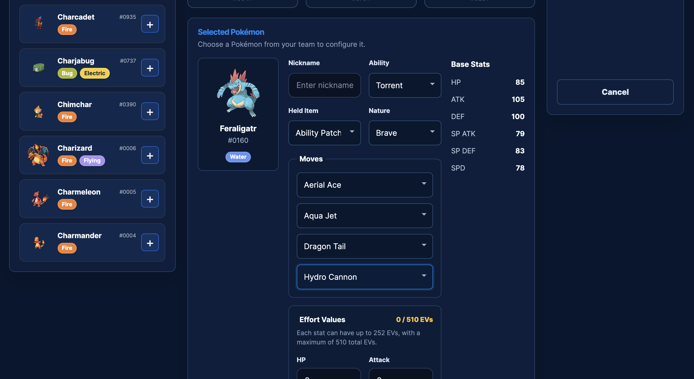

---

## Saved Teams

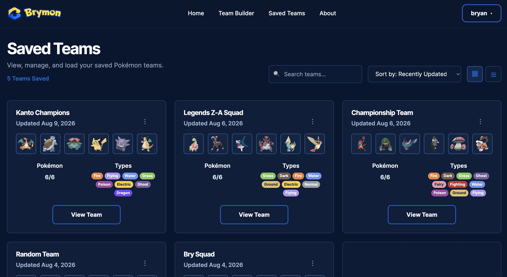

---

## Team Analysis

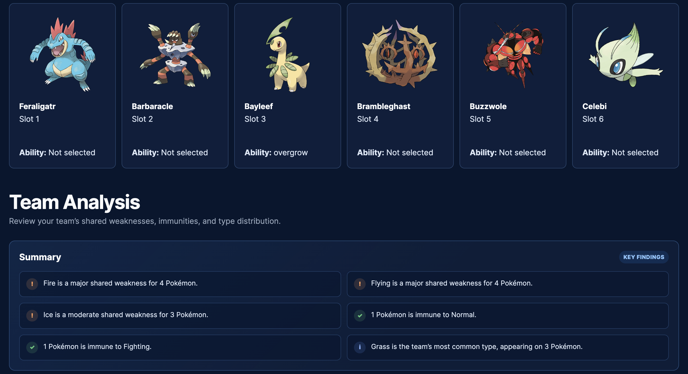

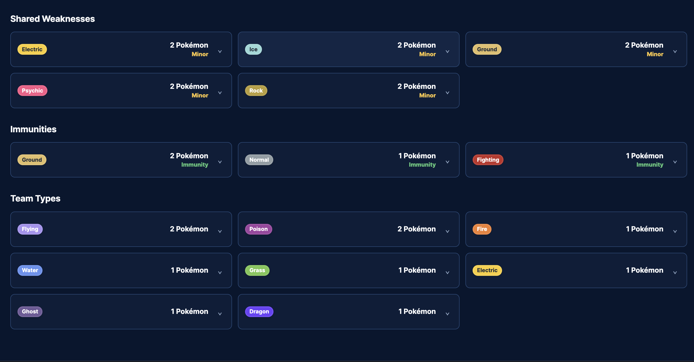

---

## Pokédex

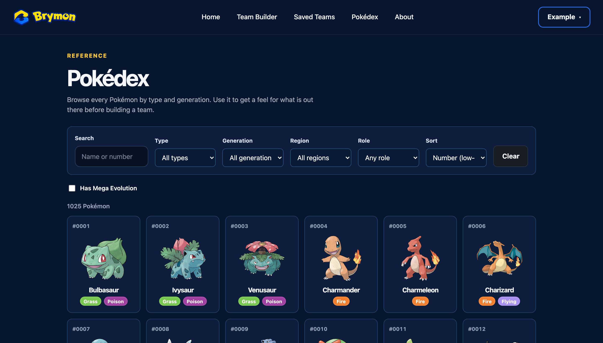

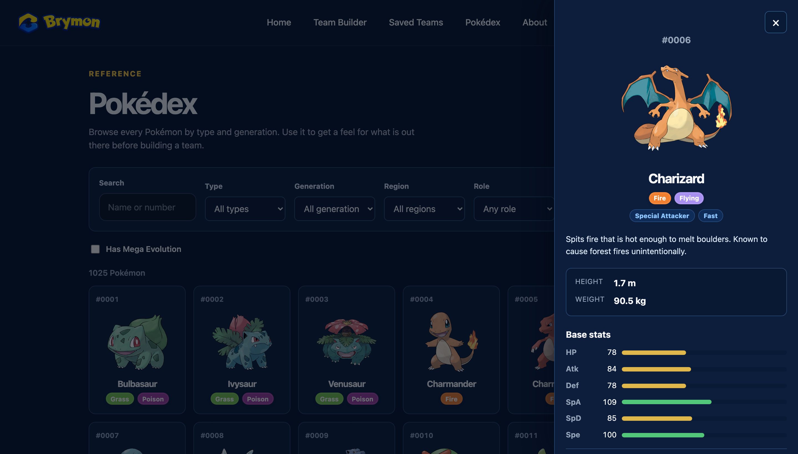

---

## Dashboard Feed

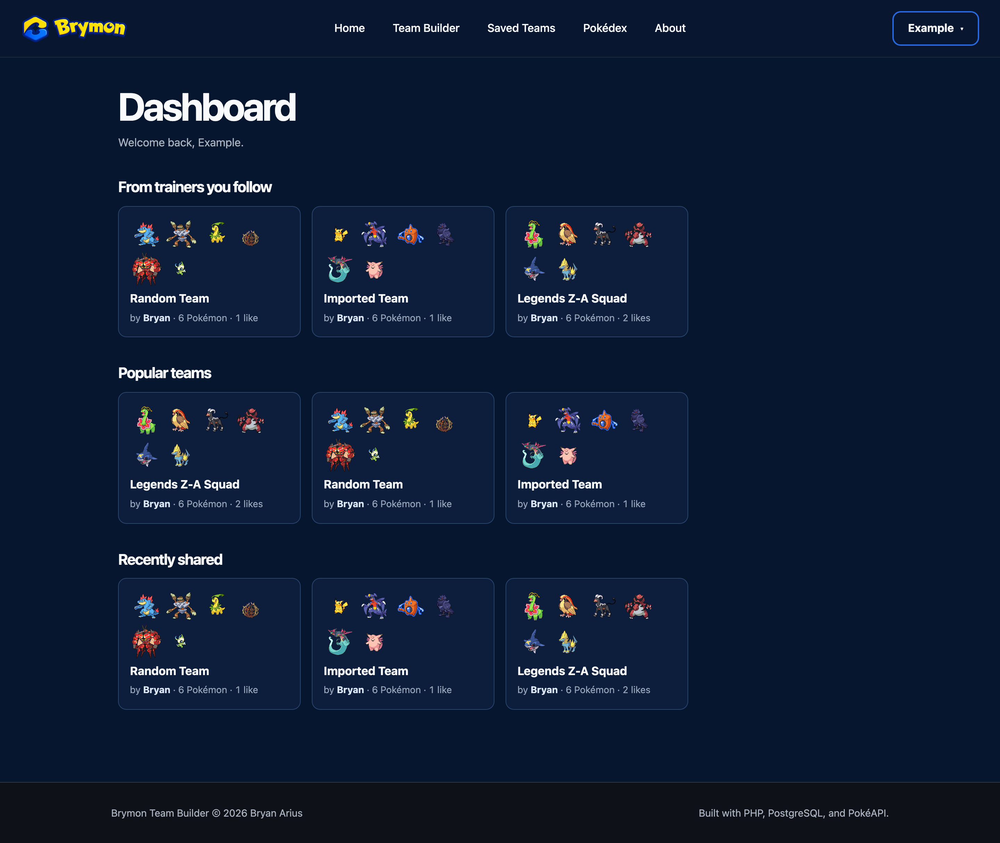

---

## Trainer Profile

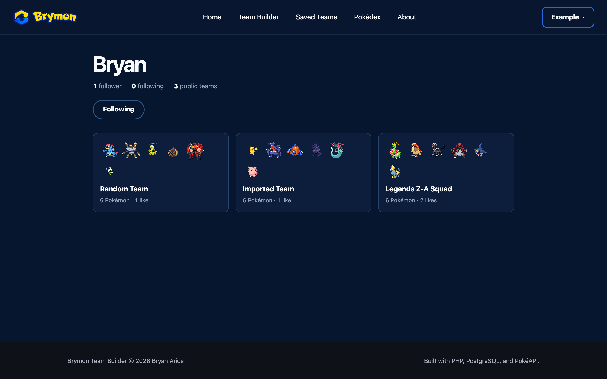

---

## Shared Team

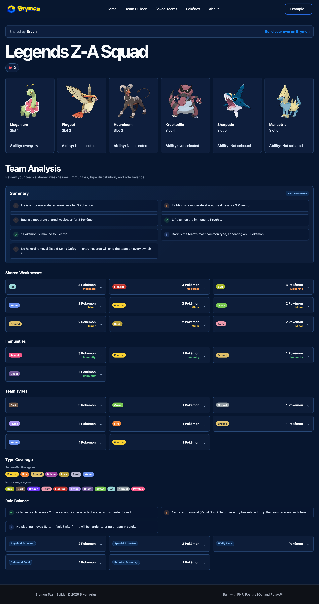

---

# Core Features

## Authentication

- User registration
- Email verification
- Resend verification email
- User login
- Login blocked until email is verified
- Forgot password / password reset via email
- Account settings — change username and password
- Secure password hashing
- Session authentication
- Session regeneration after login
- Idle and absolute session timeouts
- Route protection
- CSRF protection
- Secure logout

## Pokémon Browser

- Live Pokémon search
- Partial name search
- Generation filtering
- Type filtering
- Multiple sorting options
- Responsive search results
- PokéAPI-powered Pokémon data

## Pokédex

- Browsable index of every Pokémon
- Name / number search
- Type, generation, and region (regional Pokédex) filters
- Role filter (physical / special attacker, wall, balanced, fast, powerhouse)
- "Has a Mega Evolution" filter
- Detail panel: official artwork, base stats, abilities, flavor text
- Evolution chain and Mega Evolution navigation

## Team Builder

- Teams of up to six Pokémon
- Team names and notes
- Pokémon nicknames
- Ability selection
- Searchable held item and move selectors
- Nature selection with stat-effect hints
- Four move slots
- EV configuration
- IV configuration
- Pokémon base stats
- Dynamic team summary

## Team Management

- Create teams
- View saved teams
- Edit teams
- Delete teams
- Search saved teams
- Sort saved teams
- User-scoped team ownership

## Team Analysis

- Shared weakness analysis
- Immunity analysis
- Team type distribution
- Type coverage analysis (from the team's moves)
- Resistance recommendations for shared weaknesses
- Team role balance analysis
- Team analysis summary

## Pokémon Showdown Integration

- Import Pokémon Showdown teams
- Export Pokémon Showdown teams
- Parse moves, abilities, items, natures, EVs, and IVs

## Public Teams & Social

- Public / private visibility toggle per team
- Shareable read-only team pages (`/p/{id}`) with full analysis
- Team likes
- Following other trainers
- Trainer profiles (`/u/{username}`) listing a trainer's public teams
- Profile customization: display name, bio, and a Pokémon sprite avatar shown across the nav, feed, and profile pages
- Personalized dashboard feed: teams from trainers you follow, popular teams, and recently shared teams

---

# Validation & Security

Brymon includes server-side validation for core application and team-building rules.

Examples include:

- Maximum six Pokémon per team
- Unique team slots
- Slot numbers restricted to 1–6
- EVs restricted to 0–252 per stat
- Maximum 510 total EVs
- IVs restricted to 0–31
- Maximum four moves
- Valid Pokémon IDs
- Malformed JSON rejection
- CSRF validation for state-changing requests
- User-scoped authorization for saved teams
- Public / private team visibility enforced at the query level
- User-scoped authorization for likes and follows
- Follow relationships prevented from referencing the same user

Production errors are logged internally while users receive custom error pages for:

- 403 — Forbidden
- 404 — Not Found
- 500 — Internal Server Error

---

# Automated Testing

Brymon includes automated tests at three levels: unit, integration, and end-to-end.

## Unit Tests

PHPUnit tests cover core validation rules, including:

- Valid Pokémon configuration
- EV limits
- IV limits
- Total EV limits
- Duplicate team slots

## Integration Tests

PostgreSQL integration tests verify data-access behavior against a real database, including:

- Owners can access their own teams
- Other users cannot access or delete another user's team
- Email verification tokens are generated, hashed, and expire correctly
- Password reset tokens are generated, hashed, and expire correctly
- Resetting a password clears the reset token and implicitly verifies the email
- Account settings updates (username, password) persist and are scoped to the user
- Team visibility toggling is owner-scoped; private teams are unreachable publicly
- Team likes are idempotent and cascade on team or user deletion
- Follow relationships are idempotent, reject self-follows, and cascade on user deletion
- Dashboard feed queries order by likes / recency and stay scoped to public teams and followed trainers
- Profile fields persist and clear, username uniqueness is case-insensitive at the database level, and feed queries carry owner display names and avatars

## End-to-End Tests

Playwright tests exercise real browser workflows, including:

- Login and logout
- Team creation
- Pokémon Showdown import
- Team saving
- Viewing a saved team
- Editing a team
- Deleting a team

### Current Test Results

```text
PHPUnit

50 tests
105 assertions
100% passing


Playwright

2 end-to-end tests
100% passing
```

Run the complete automated test suite with:

```bash
./vendor/bin/phpunit
npx playwright test
```

---

# Why Brymon?

Brymon was intentionally built without Laravel or another full-stack PHP framework for Version 1.

The goal was to develop a deeper understanding of the mechanics that frameworks normally abstract away, including:

- Routing
- Controllers
- Models
- Views
- Authentication
- Authorization
- Sessions
- Database access
- Validation
- CSRF protection
- Error handling
- Application structure

Building these systems manually provided hands-on experience with how full-stack web applications work beneath modern frameworks.

---

# Design & Architecture Process

Brymon was designed and planned before development.

The project moved through user-flow planning, low-fidelity wireframes, high-fidelity mockups, database modeling, and application architecture before reaching the final production implementation.

---

## User Flow

The user flow was created to map the primary experience through Brymon before implementation.

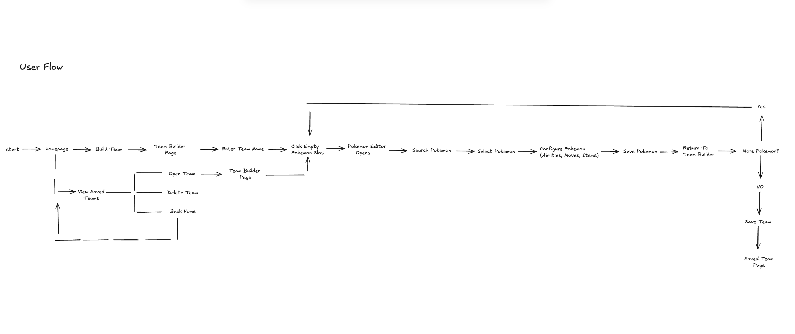

It helped define how users move through authentication, team creation, Pokémon configuration, saved teams, and team management.

---

## Low-Fidelity Wireframes

Low-fidelity wireframes were created before visual design to establish page structure, information hierarchy, and the application's primary interactions.

### Home

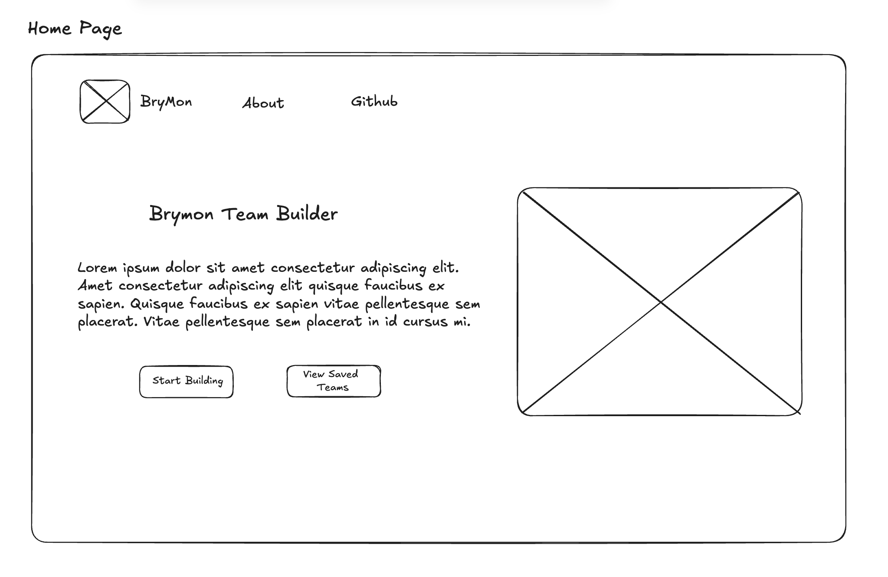

### Team Builder

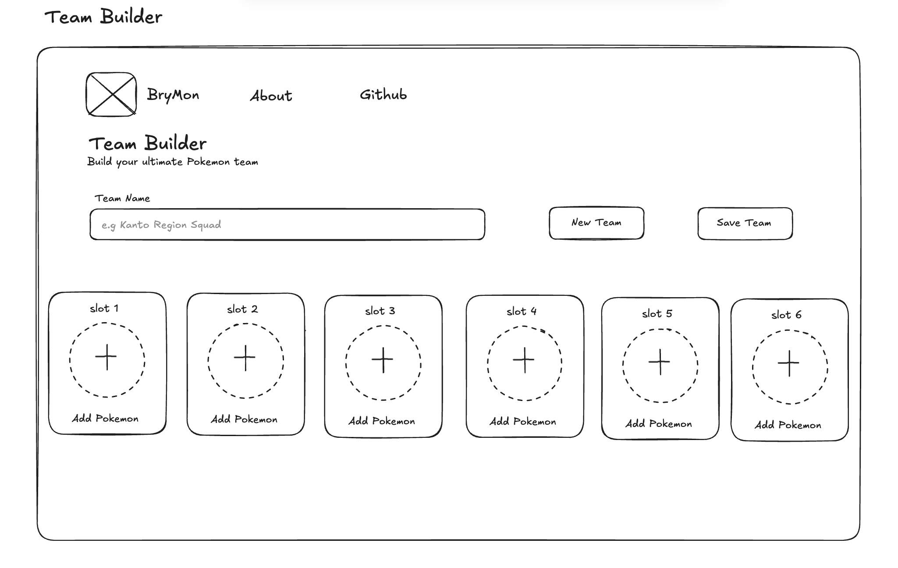

### Pokémon Editor

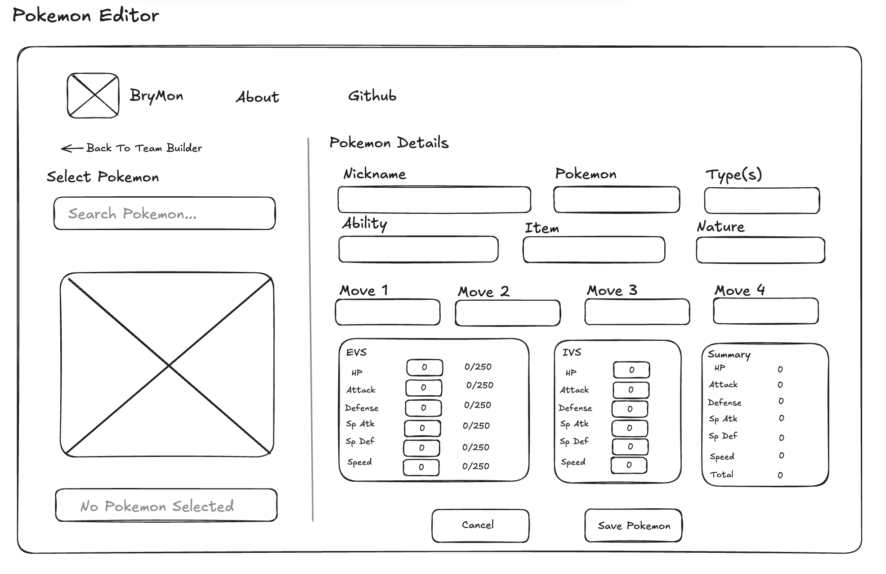

### Saved Teams

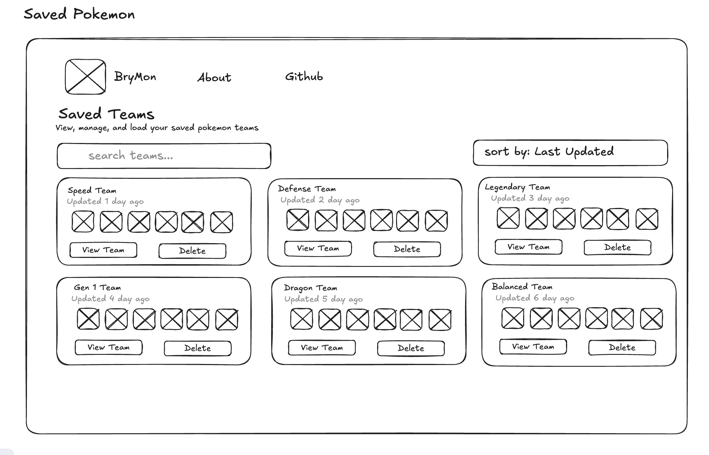

---

## High-Fidelity Mockups

The low-fidelity concepts were developed into high-fidelity mockups that established Brymon's visual design system, layout, typography, spacing, and component styling before implementation.

### Home


### Team Builder


### Saved Teams


### About


---

## Database Design

The PostgreSQL database structure was planned using an entity-relationship diagram before implementing the application's persistence layer.

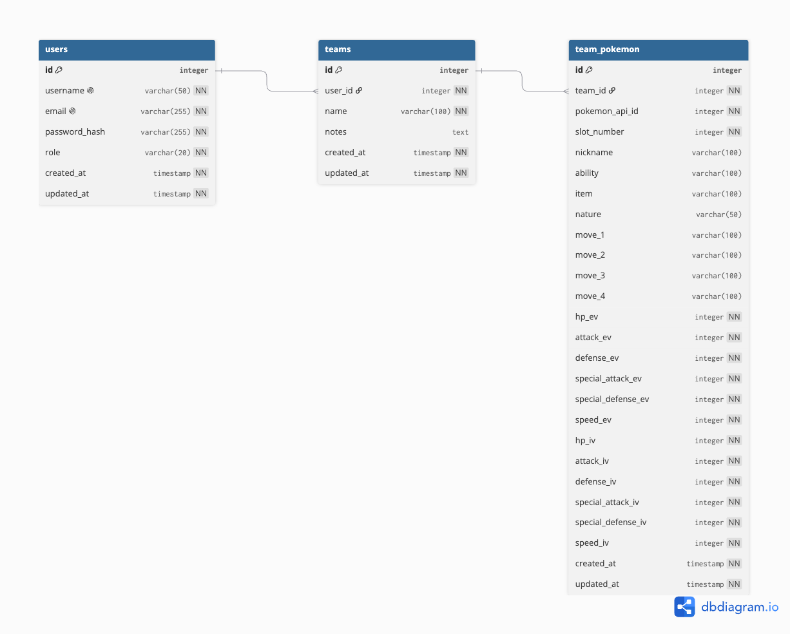

The database design supports:

- User accounts and ownership
- Multiple teams per user
- Multiple Pokémon per team
- Ordered team slots
- Pokémon configuration data
- Referential integrity between application entities

---

## MVC Architecture

Brymon uses a custom MVC architecture built specifically for the project.

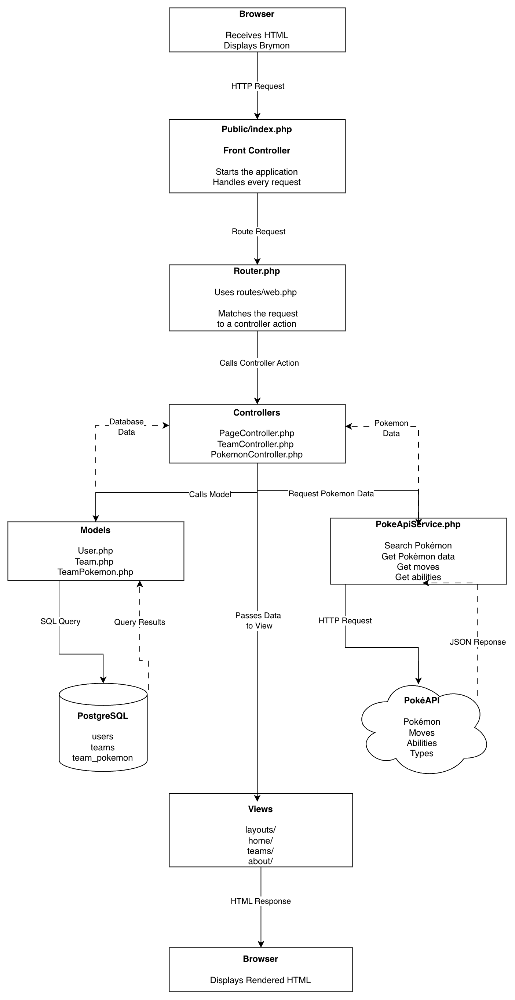

The architecture separates the application into:

- **Router** — matches incoming HTTP requests to application actions
- **Controllers** — coordinate requests and application behavior
- **Models** — handle PostgreSQL persistence and data access
- **Views** — render the user interface
- **Core services** — provide shared functionality such as authentication, sessions, CSRF protection, validation, configuration, and database connectivity

---

## From Concept to Production

Brymon followed a deliberate development process:

```text
User Flow
    ↓
Low-Fidelity Wireframes
    ↓
High-Fidelity Mockups
    ↓
Database Design
    ↓
MVC Architecture
    ↓
Implementation
    ↓
Automated Testing
    ↓
Production Deployment
```

This process allowed Brymon to evolve from an initial product concept into a tested, production-deployed full-stack application.

---

# Tech Stack

| Layer              | Technology                      |
| ------------------ | ------------------------------- |
| Frontend           | HTML5, CSS3, Vanilla JavaScript |
| Icons              | Font Awesome                    |
| Backend            | PHP 8                           |
| Architecture       | Custom MVC                      |
| Database           | PostgreSQL                      |
| Database Access    | PDO                             |
| External API       | PokéAPI (REST + GraphQL)        |
| Email              | Resend                          |
| Testing            | PHPUnit, Playwright             |
| Package Management | Composer, npm                   |
| Deployment         | Docker, Render                  |
| Version Control    | Git & GitHub                    |

---

# Application Architecture

At a high level, requests move through Brymon's custom MVC architecture before interacting with PostgreSQL.

```text
Browser
   │
   ▼
Router
   │
   ▼
Controllers
   │
   ├──────────────► Views
   │
   ▼
Models
   │
   ▼
PostgreSQL

Browser / JavaScript
   │
   ▼
PokéAPI
```

---

# Project Structure

```text
Brymon/
│
├── app/
│   ├── Controllers/     # Page, Auth, Account, Team, Profile, Dashboard
│   ├── Core/            # Router, Auth, Csrf, Validator, Database, Mailer, Config
│   ├── Models/          # Team, User, Follow, TeamLike
│   └── Views/           # feature-grouped templates, shared layouts and partials
│
├── database/
│   ├── schema.sql
│   └── seeds.sql
│
├── docs/
│   ├── architecture/
│   ├── database/
│   │   └── migrations/  # incremental, hand-applied SQL migrations
│   ├── high-fi/
│   ├── low-fi/
│   └── screenshots/
│
├── public/
│   ├── css/             # feature-scoped stylesheets + design tokens
│   ├── favicon/
│   ├── images/
│   ├── js/              # one file per feature area, no build step
│   └── index.php        # front controller
│
├── routes/
│   └── web.php
│
├── tests/
│   ├── Unit/
│   ├── Integration/
│   └── E2E/
│
├── composer.json
├── package.json
├── phpunit.xml
└── Dockerfile
```

---

# Engineering Concepts Demonstrated

Brymon demonstrates experience across multiple areas of full-stack software development.

## Backend Engineering

- Custom MVC architecture
- Object-oriented PHP
- Custom routing
- Controller design
- Model abstraction
- PostgreSQL database design
- Incremental SQL migrations
- Many-to-many relationships (team likes, trainer follows)
- Aggregate queries and ranked / filtered feeds
- PDO database access
- Prepared SQL statements
- Transactional database operations
- Server-side validation

## Authentication & Security

- Authentication
- Authorization
- Email verification with expiring, hashed tokens
- Password reset with expiring, hashed tokens
- Password hashing
- Session management
- Session regeneration
- CSRF protection
- User-scoped resource ownership
- Production-safe error handling
- Transactional email delivery (Resend)

## Frontend Engineering

- Semantic HTML
- Responsive CSS with a shared design-token layer
- Vanilla JavaScript, no build step
- Reusable components (searchable combobox, shared team card partial)
- Asynchronous API requests
- Client-side state management
- Dynamic UI rendering
- Accessible dialog / focus management (Pokédex detail panel)
- Form validation
- Responsive navigation

## API Integration

- PokéAPI integration (REST and GraphQL)
- Pokémon data retrieval and bulk stat queries
- Client-side caching of API responses
- Pokémon Showdown parsing
- Pokémon Showdown import/export

## Testing

- PHPUnit unit testing
- PostgreSQL integration testing
- Playwright browser testing
- End-to-end CRUD testing
- Authentication workflow testing

## Deployment

- Docker
- Render
- PostgreSQL production database
- Environment-based configuration
- Custom domain configuration
- Git and GitHub workflow

---

# Version 1 Roadmap

## ✅ Phase 0 — Planning

- [x] Project planning
- [x] MVP definition
- [x] User flows
- [x] Database design

---

## ✅ Phase 1 — UI / UX

- [x] Low-fidelity wireframes
- [x] High-fidelity mockups
- [x] Responsive design system

---

## ✅ Phase 2 — Backend Architecture

- [x] Custom MVC architecture
- [x] Routing
- [x] PostgreSQL integration
- [x] Authentication
- [x] Authorization
- [x] Session management
- [x] Docker deployment

---

## ✅ Phase 3 — Core Application

- [x] Homepage
- [x] About page
- [x] Authentication
- [x] Pokémon search
- [x] Search filters
- [x] Add Pokémon to team
- [x] Pokémon configuration
- [x] Team CRUD
- [x] Saved teams
- [x] Team analysis
- [x] Pokémon Showdown import
- [x] Pokémon Showdown export

---

## ✅ Phase 4 — Production Readiness

- [x] Backend validation
- [x] CSRF protection
- [x] Production error handling
- [x] Custom 403 page
- [x] Custom 404 page
- [x] Custom 500 page
- [x] PHPUnit unit tests
- [x] PostgreSQL integration tests
- [x] Playwright end-to-end tests
- [x] Responsive production UI
- [x] Custom production domain
- [x] Render deployment

---

# Future Roadmap

## Version 2

### ✅ Completed

- [x] Email verification
- [x] Password reset
- [x] Account settings
- [x] Deeper team analysis
  - [x] Type coverage analysis
  - [x] Shared weakness recommendations
  - [x] Team role balance
- [x] Searchable item and move selectors
- [x] Add Pokédex
- [x] Public teams and sharing
  - [x] Public / private team visibility
  - [x] Shareable read-only team pages
  - [x] Team likes
  - [x] Following trainers
  - [x] Trainer profiles (`/u/{username}`)
  - [x] Dashboard feed (popular, recent, following)
- [x] Profile customization
  - [x] Display name
  - [x] Bio
  - [x] Pokémon avatar

### Planned

- [ ] Additional accessibility improvements
- [ ] Additional usability improvements

---

## Version 3

Possible modernization and architecture experiments include:

- REST API
- React or Vue frontend
- Laravel backend
- Custom uploaded profile pictures
- Advanced analytics
- Performance optimization
- Expanded automated testing

---

# Installation

## Requirements

To run Brymon locally, you will need:

- PHP 8+
- Composer
- PostgreSQL
- Node.js
- npm

---

## 1. Clone the Repository

```bash
git clone https://github.com/bryanarius/brymon-team-builder.git

cd brymon-team-builder
```

---

## 2. Install PHP Dependencies

```bash
composer install
```

---

## 3. Install JavaScript Dependencies

```bash
npm install
```

---

## 4. Configure the Environment

Copy the example environment file:

```bash
cp .env.example .env
```

Configure your local PostgreSQL credentials:

```env
APP_ENV=development
APP_URL=http://localhost:8000

DB_HOST=127.0.0.1
DB_PORT=5432
DB_NAME=brymon
DB_USER=your_username
DB_PASSWORD=your_password

RESEND_API_KEY=your_resend_api_key
MAIL_FROM=noreply@yourdomain.com
```

`APP_URL` is used to build the absolute links sent in verification and password reset emails. `RESEND_API_KEY`/`MAIL_FROM` are used to send those emails via [Resend](https://resend.com) — `MAIL_FROM`'s domain must be a verified sending domain in your Resend account.

---

## 5. Configure PostgreSQL

Create a PostgreSQL database for Brymon and load the application's schema and migrations.

---

## 6. Start the Development Server

```bash
php -S localhost:8000 -t public
```

Visit:

```text
http://localhost:8000
```

---

# Running Tests

## PHPUnit

Run all PHPUnit unit and integration tests:

```bash
./vendor/bin/phpunit
```

Current test suite:

```text
50 tests
105 assertions
```

---

## Playwright

Run the browser-based end-to-end tests:

```bash
npx playwright test
```

Current E2E suite:

```text
2 tests
```

The E2E tests cover authentication and Brymon's primary team-management workflow.

---

## Test Database

Integration tests use a separate PostgreSQL test database.

Example `.env.testing`:

```env
APP_ENV=testing

DB_HOST=127.0.0.1
DB_PORT=5432
DB_NAME=brymon_test
DB_USER=your_username
DB_PASSWORD=your_password
```

Keeping the test database separate prevents automated tests from modifying development or production data.

---

# Lessons Learned

Building Brymon provided hands-on experience with the full software development lifecycle.

Key lessons included:

- Designing normalized relational database schemas
- Evolving a schema safely with incremental migrations
- Modeling a social graph (likes and follows) with join tables and unique constraints
- Building ranked and filtered feed queries with SQL aggregates
- Building a custom MVC architecture
- Understanding routing beneath full-stack frameworks
- Implementing authentication and authorization
- Managing secure PHP sessions
- Protecting state-changing requests with CSRF tokens
- Designing validation at both client and server levels
- Integrating third-party APIs over REST and GraphQL
- Managing complex browser-side state
- Building transactional PostgreSQL operations
- Handling resource ownership and authorization
- Writing unit, integration, and end-to-end tests
- Handling production errors safely
- Deploying a Dockerized PHP application
- Configuring a production PostgreSQL database
- Configuring a custom production domain
- Moving a project from initial planning through production release

---

# Acknowledgements

Pokémon data and artwork are provided through **PokéAPI**.

https://pokeapi.co/

Brymon is a fan-made educational portfolio project and is not affiliated with or endorsed by Nintendo, Game Freak, Creatures Inc., or The Pokémon Company.

Pokémon and all related trademarks are property of their respective owners.

---

# License

This project is licensed under the MIT License.
