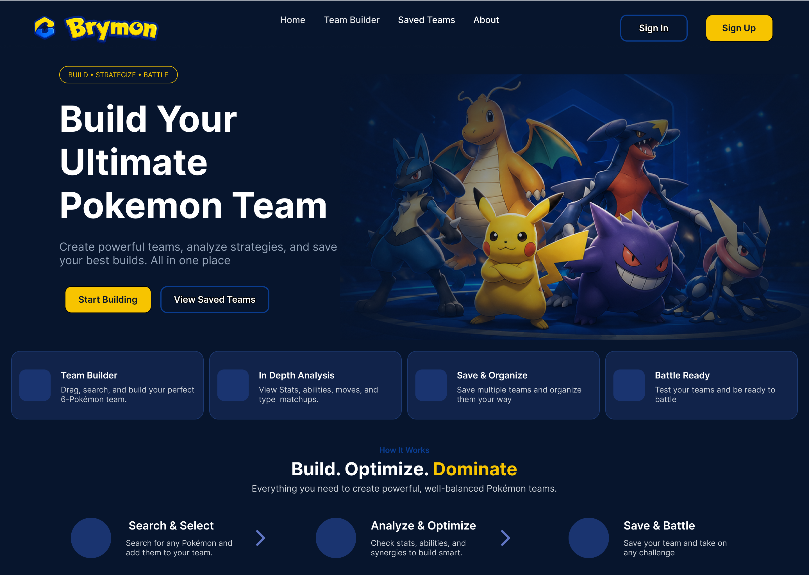
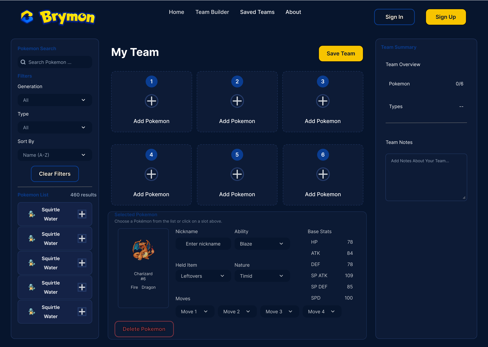
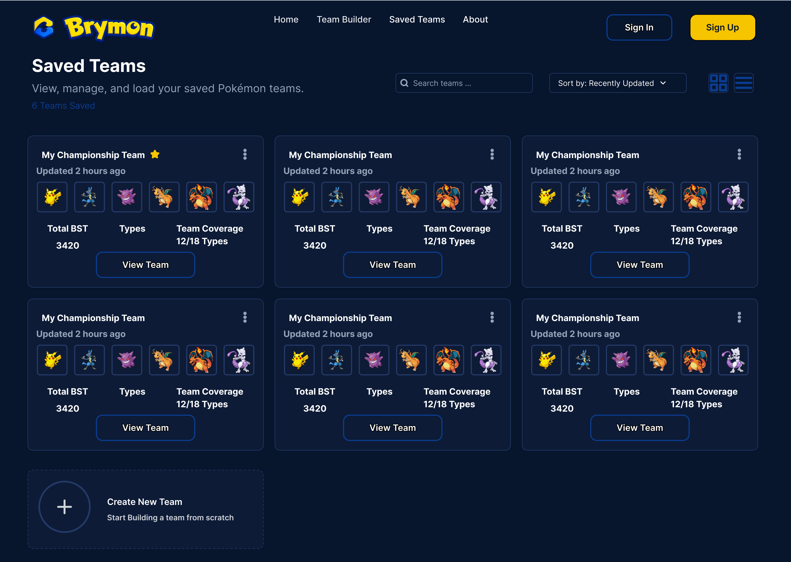
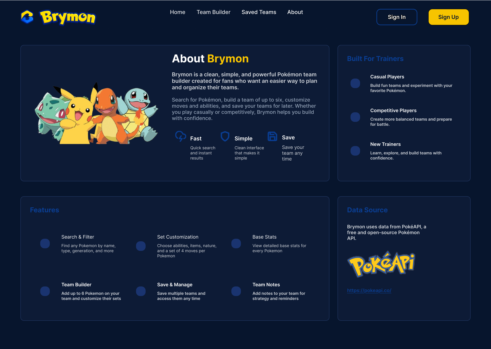

# Brymon Team Builder

A modern full-stack Pokémon team builder built with **PHP**, **PostgreSQL**, **JavaScript**, and the **PokéAPI**.

> 🚧 **Status:** In Development (Version 1)

## Live Demo

https://brymon-team-builder.onrender.com

---

## Home



---

## Team Builder



---

## Saved Teams



---

## About



---

# Overview

Brymon Team Builder is a full-stack portfolio project built to demonstrate modern software engineering principles by creating a Pokémon team builder from scratch.

Users can search Pokémon, customize team members, build complete teams, and save them for later while the project demonstrates:

- MVC Architecture
- Object-Oriented PHP
- PostgreSQL Database Design
- CRUD Operations
- REST API Integration
- Responsive UI Design
- Git Version Control

---

# Why Brymon?

Brymon was created to strengthen my full-stack development skills by building a complete web application from planning through deployment.

Rather than recreating an existing website, this project focuses on designing and implementing a maintainable application using a custom PHP MVC architecture, relational database design, and third-party API integration.

---

# Tech Stack

| Layer             | Technology              |
| ----------------- | ----------------------- |
| Frontend          | HTML5, CSS3, JavaScript |
| Backend           | PHP                     |
| Architecture      | Custom MVC              |
| Database          | PostgreSQL              |
| API               | PokéAPI                 |
| Development Tools | Git, GitHub, VS Code    |

---

# Version 1 MVP Features

## Team Management

- Create Teams
- Save Teams
- Edit Teams
- Delete Teams
- View Saved Teams

## Pokémon Management

- Search Pokémon
- Add up to 6 Pokémon
- View Pokémon Details
- Configure Moves
- Configure Abilities
- Configure Items
- Configure Natures
- Configure EVs
- Configure IVs

## Database

- Store Teams
- Retrieve Teams
- Update Teams
- Delete Teams

---

# Project Roadmap

## ✅ Phase 0 — Planning

- [x] Project Outline
- [x] MVP Definition
- [x] User Flow

---

## ✅ Phase 1 — Design

- [x] Low-Fidelity Wireframes
- [x] High-Fidelity Mockups

---

## ✅ Phase 2 — Technical Design

- [x] Database ERD
- [x] MVC Architecture
- [x] Routing Design

---

## 🚧 Phase 3 — Development

- [ ] Homepage
- [ ] Team Builder
- [ ] Pokémon Search
- [ ] Pokémon Editor
- [ ] Saved Teams
- [ ] PokéAPI Integration
- [ ] CRUD Functionality

---

## ⏳ Phase 4 — Polish

- [ ] Responsive Design
- [ ] Form Validation
- [ ] Error Handling
- [ ] Testing
- [ ] Deployment

---

# Project Structure

```text
Brymon/
│
├── app/
│   ├── Controllers/
│   ├── Models/
│   └── Views/
│
├── config/
│
├── database/
│
├── docs/
│   └── images/
│
├── public/
│
├── routes/
│
└── storage/
```

---

# What This Project Demonstrates

- Object-Oriented PHP
- MVC Architecture
- PostgreSQL
- Database Design
- CRUD Operations
- REST API Integration
- Responsive Design
- UI/UX Design
- Git Workflow

---

# Future Enhancements

## Version 2

- User Authentication
- Team Analysis
- Type Weakness Calculator
- Public Team Sharing
- User Profiles

## Version 3

- Laravel
- React or Vue
- REST API
- Team Analytics Dashboard
- Improved Scalability

---

# Installation

```bash
git clone https://github.com/YOUR_USERNAME/brymon.git
```

1. Install PostgreSQL.
2. Create the Brymon database.
3. Import the database schema.
4. Configure your database credentials.
5. Start your local PHP server.
6. Visit the application in your browser.

---

# Acknowledgements

Pokémon data and sprites are provided by **PokéAPI**.

https://pokeapi.co/

Brymon is a fan-made educational portfolio project and is not affiliated with or endorsed by Nintendo, Game Freak, Creatures Inc., or The Pokémon Company.

Pokémon and all related trademarks are the property of their respective owners.

---

# License

This project is licensed under the MIT License.
